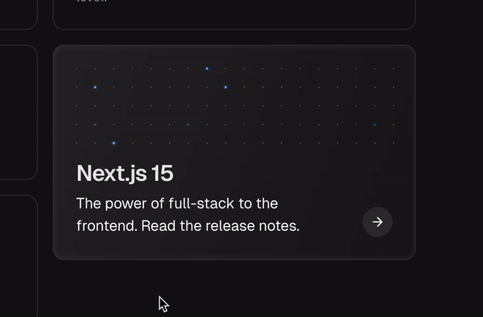

# Switchboard Widget 🔌✨

> On Next.js' website, they have a pretty cool switchboard widget, that I thought would be fun to try and reverse engineer and  create my own.



## Overview

This project recreates and reimagines the captivating switchboard animation from the Next.js website. The widget features an array of interactive lights that sparkle randomly and reveal text ("JOHN") when users hover over the component. Each light dynamically transitions between different states, creating a mesmerizing visual effect.

[View my version here.](https://switchboard-widget.vercel.app/)

## ✨ Features

- **Dynamic Light Animation**: Random sparkle effects when idle
- **Interactive Hover State**: Reveals hidden text through coordinated light patterns
- **Smooth State Transitions**: Elegant transitions between light states (off, medium, high)
- **Responsive Grid Layout**: Adapts to container size while maintaining aspect ratio
- **Customizable Text**: Configurable light indices to display different text patterns

## 🛠️ Technical Implementation

### Core Components

- **Light Grid System**: 
  - 5 x 18 grid layout (90 total lights)
  - Each light maintains its own state and animation status
  - Custom grid mapping for text display

- **Light States**:
  ```typescript
  interface Light {
    state: 'off' | 'medium' | 'high';
    isAnimating: boolean;
  }
  ```

- **Animation System**:
  - Random sparkle generation using probability-based triggers
  - Coordinated state transitions for text reveal
  - Customizable animation timing and delays

### Technical Challenges

1. **Light Effect Optimization**: 
   - Implemented efficient state management to handle 90 simultaneous light animations
   - Optimized render cycles to prevent performance issues
   
2. **Visual Design**: 
   - Created smooth transitions between light states using Tailwind CSS
   - Engineered a realistic light bloom effect using multiple layers
   
3. **State Coordination**:
   - Developed a system to coordinate multiple light states for text reveal
   - Managed complex state transitions while maintaining smooth animations

<!-- ## 🚀 Installation & Usage

1. Install dependencies:
```bash
npm install
```

2. Import the component:
```typescript
import Switchboard from './components/Switchboard';
```

3. Use in your React application:
```jsx
function App() {
  return (
    
  );
}
``` -->

## 💻 Tech Stack

- React
- TypeScript
- Tailwind CSS
- Vite
 
## 🎨 Customization

The switchboard can be customized by modifying:

- `ROWS` and `COLS` constants for grid size
- `JOHN_INDICES` array for different text patterns
- Animation timing in `getRandomDelay()`
- Light appearance using Tailwind classes

## 📚 Lessons Learned

- Complex state management for large numbers of animated elements
- Performance optimization techniques for React components
- Advanced CSS animation and transition techniques
- Implementing precise timing for coordinated animations

## 🛠️ Future Improvements

- Add customizable text input
- Add ability to export widget
- Implement different animation patterns
- Add color customization options
- Create presets for common text layouts
- Algorithm to dynamically create text letters

## 📝 License

MIT © [John Michael Darrin]

---

*Built with ❤️ by John*